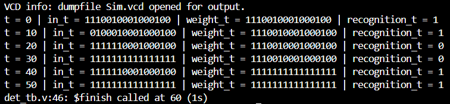

  

  Testbench Waveform

  

  Detector recognizes Equivalence & Sub-Patterns

### Port Map - `det.v`

| Port | Direction | Width |
|------|-----------|-------|
| `in` | input | [15:0] |
| `weight` | input | [15:0] |
| `recognition` | output | 1 |

> *Generated by [portmap](https://github.com/KARAN-D05/portmap-HDL/blob/main/portmap.nim) - Nim port extractor*

> *Precompiled Binary Release [Portmap-linux-x64/portmap-windows-x64.exe](https://github.com/KARAN-D05/portmap-HDL/releases/tag/v1.0.0)*
