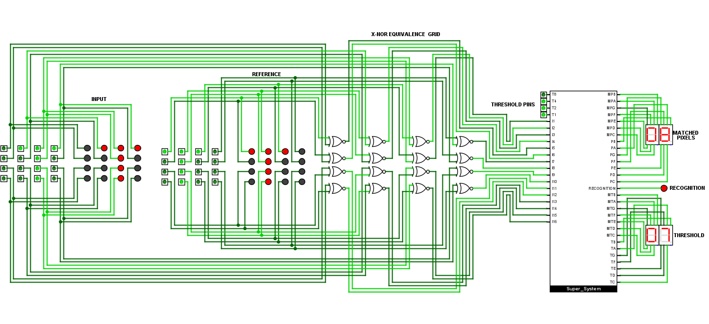
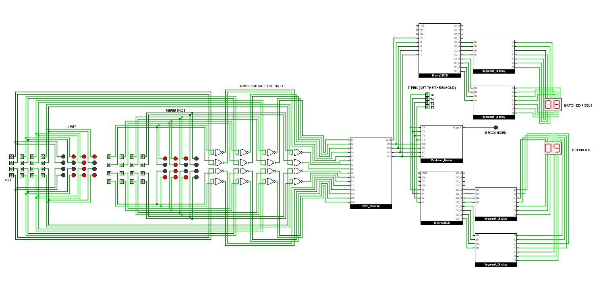

# 📊 POP-Count Based Detector-V1.0
- It recognizes the pattern if the number of `Matched Pixels (M)` are greater than the set `Threshold(θ)`

## 👥 Population Counter
- It calculates the total number of matched pixels (M)
- It is a module made up of 60 Half-adders, that counts total number of it's inputs that are 1
- It is based on principle of succesively adding bits of same Weight until we have compressed that set of bits with same weight W into a single bit of weight W
- A half adder has two outputs, SUM and CARRY, if weight of output of SUM is W then weight of output of CARRY is 2W
- It can also be implemented using a full-adder which will lead to same compression employing less number of full-adders than half-adders
  
   - **Logical Implementation:**
        
➤ 8 Half-adders divides the 16 inputs into 8 SUM bits of weight 1 and 8 CARRY bits of weight 2 
 
        
➤ Then we use 4 half-adders to further divide 8 SUM bits of weight 1 into 4 SUM bits and 4 CARRY bits 

        
➤ As we keep dividing the SUM bits of weight 1 until we are left with a single bit of Weight 1 

        
➤ Similarly for bits of weight 2 and succesive weights we repeat the same steps until we reach the single bit of that weight 

        
➤ If inputs A and B of half adder are of weight W (8), then the SUM bit will be of same weight W (8), and CARRY bit will be of twice the weight 2W (16) of that of the input 

  

## 🏛️ Decision-Maker
- It is the brain of the machine, it decides if the input pattern is recognized or not.
- For pattern recongition total number of matched pixels(M) is greater than the threshold(θ)
   - `Pattern Recognized: M > θ`
   - `Pattern Not Recognized: M ≤ θ`
- Threshold can be set using the T-pins or the Threshold pins, threshold range from 0(0000) - 15 (1111)
- It is essentially a Comparator that goes high if M is greater than θ

   - Se

<figure style="text-align:center;">
  
  <figcaption> 0 = 7 & M = 8, M > θ: hence Pattern is recognized</figcaption>
</figure>

<figure style="text-align:center;">
  
  <figcaption>0 = 9 & M = 8, M ≤ θ: hence Pattern is not recognized</figcaption>
</figure>

## ⚖️ X-NOR Equivalence Grid
- 

