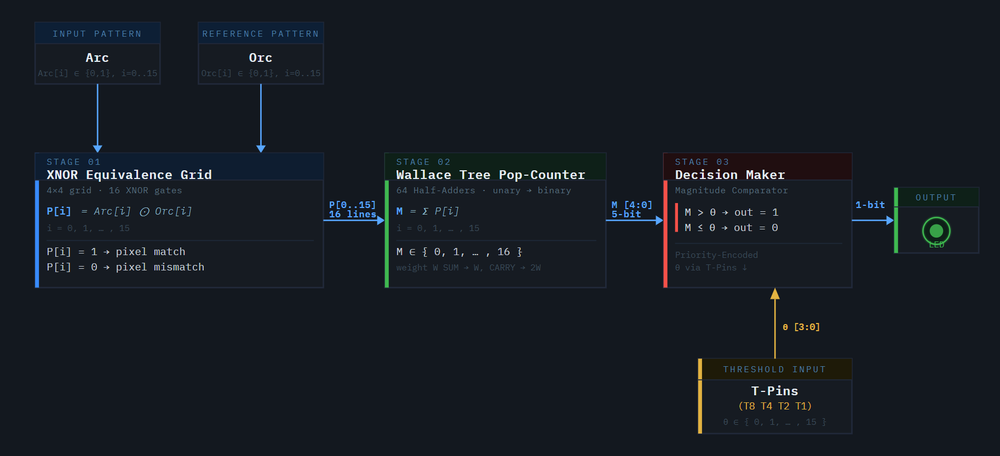
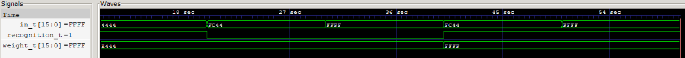
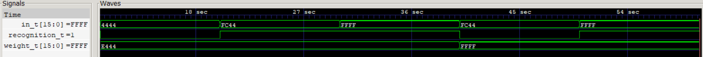

# 🔍 Gate Level Perceptron

    

- This project explores pattern recognition at logic-gate level.
  
- It began as an attempt to build **`perceptron-like system`** for recognizing patterns, but early versions evolved into a strictly logical pattern relation anlyzer using strict boolean logic.
  
- Subsequent versions transitioned from rigid equivalence checks to popcount-based scoring and threshold decisions, moving the architecture toward a true perceptron and, eventually self learning behaviour.

    
    
  θ = 7 & M = 8, M > θ: hence Pattern is recognized ✅ 

    
    
   θ = 9 & M = 8, M ≤ θ: hence Pattern is not recognized ❌ 

## ⚙️ Implementation Stack

## 🧱 Versions Built
- **`Version 0`**: A pattern relation analyzer that classifies how an input pattern relates to a stored pattern, enforces rule based recognition rather than learning.
  - [Detector_v0.0](Detector_v0.0) -> Recognizes the pattern and sub-patterns if they are inside the boundary set up by weights-grid.
  - [Detector v0.1](Detector_v0.1) -> Recognizes the pattern and super-patterns if they are outside the boundary set up by weights-grid.
  - [Detector v0.2](Detector_v0.2) -> Classifies the input as a sub-pattern, super-pattern, anti-pattern or equivalence precisely through a 2-POV logical analysis.

- **`Version 1`**: Pop-count based judgement against a variable Threshold instead of perfect equivalence check, takes us one step closer to self-learning adaptive machines.
  - [Detector_v1.0](Detector_v1.0) -> Recognizes the pattern if total number of matched pixels are greater than the set threshold. 

## 💻 Verilog Implementation
- [Detector_v0.0](Detector_v0.0/Verilog-Implementation)

    
    
 Equivalence & Sub-Pattern Recognition 🔹 

- [Detector_v0.1](Detector_v0.1/Verilog-Implementation)

    
    
 Equivalence & Super-Pattern Recognition 🟦 

- [Detector_v0.2](Detector_v0.2/Verilog-Implementation)

    
    
 Equivalence & Super & Sub & Anti-Pattern Recognition 🔹🟦 

## 🔜 Future Versions
- Feedback-driven adaptation on top of the existing popcount-based judgement mechanism.
- Automatic threshold adjustment based on feedback which would allow the detector to gradually converge towards an apropriate threshold.
- It would form basis of simple self-learning adaptive system. 

## 🛠️Current Development:
 - Population Counter Developed and operation verified ✓
 - Comparator Developed for comparing the Pop-count(M) with the threshold(θ) to make decisions ✓
 - Pop-Count based pattern detector developed and tested ✓
 - Detector Version 0 series implemented in Verilog ✓

## 📜License
- Source code and HDL files are licensed under the MIT License.
- Documentation, diagrams, images, and PDFs are licensed under Creative Commons Attribution 4.0 (CC BY 4.0).
