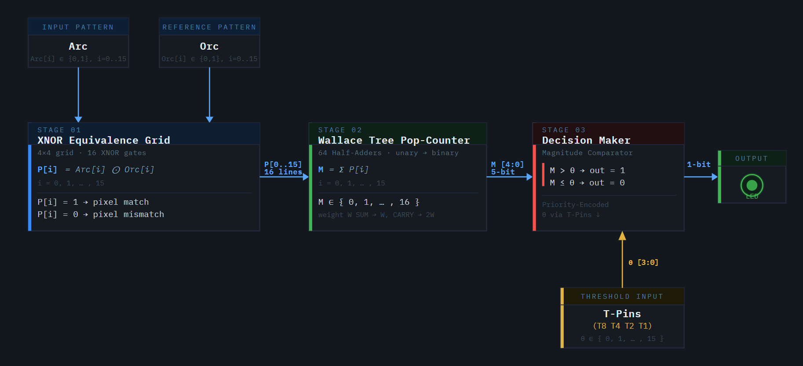

# 🔍 Gate Level Perceptron
- This project explores pattern recognition at logic-gate level.
  
- It began as an attempt to build **`perceptron-like system`** for recognizing patterns, but early versions evolved into a strictly logical pattern relation anlyzer using strict boolean logic.
  
- Subsequent versions transitioned from rigid equivalence checks to popcount-based scoring and threshold decisions, moving the architecture toward a true perceptron and, eventually self learning behaviour.

<p align="center">
  
</p>

<p align="center">
  🧩 Block-Diagram - Detector_v1.0 
</p>

## ⚙️ Implementation Stack


## 🧱 Versions Built
- **`Version 0`**: A pattern relation analyzer that classifies how an input pattern relates to a stored pattern, enforces rule based recognition rather than learning.
  - [Detector_v0.0](Detector_v0.0) -> Recognizes the pattern and sub-patterns if they are inside the boundary set up by weights-grid.
  - [Detector v0.1](Detector_v0.1) -> Recognizes the pattern and super-patterns if they are outside the boundary set up by weights-grid.
  - [Detector v0.2](Detector_v0.2) -> Classifies the input as a sub-pattern, super-pattern, anti-pattern or equivalence precisely through a 2-POV logical analysis.

- **`Version 1`**: Pop-count based judgement against a variable Threshold instead of perfect equivalence check, takes us one step closer to self-learning adaptive machines.
  - [Detector_v1.0](Detector_v1.0) -> Recognizes the pattern if total number of matched pixels are greater than the set threshold. 

<p align="center">
  
</p>

<p align="center">
  θ = 7 & M = 8, M > θ: hence Pattern is recognized ✅
</p>

<p align="center">
  
</p>

<p align="center">
  θ = 9 & M = 8, M ≤ θ: hence Pattern is not recognized ❌
</p>

## 💻 Verilog Implementation
- [Detector_v0.0](Detector_v0.0/Verilog-Implementation)

<div align="center">
    
    <p> Equivalence & Sub-Pattern Recognition 🔹 </p>
</div>

- [Detector_v0.1](Detector_v0.1/Verilog-Implementation)

<div align="center">
    
    <p> Equivalence & Super-Pattern Recognition 🟦 </p>
</div>

- [Detector_v0.2](Detector_v0.2/Verilog-Implementation)

<div align="center">
    
    <p> Equivalence & Super & Sub & Anti-Pattern Recognition 🔹🟦 </p>
</div>

## 🔜 Future Versions
- Feedback-driven adaptation on top of the existing popcount-based judgement mechanism.
- Automatic threshold adjustment based on feedback which would allow the detector to gradually converge towards an apropriate threshold.
- It would form basis of simple self-learning adaptive system. 

## 🛠️Current Development:
 - Population Counter Developed and operation verified ✓
 - Comparator Developed for comparing the Pop-count(M) with the threshold(θ) to make decisions ✓
 - Pop-Count based pattern detector developed and tested ✓
 - Detector Version 0 series implemented in Verilog ✓

## 🛠️ Toolchain

This project includes a built-in reference manual for the detector architecture that can be queried directly from your terminal. View full manual: [detector-manual](https://github.com/KARAN-D05/Gate-Level-Perceptron/tree/main/detector-manual)

**Linux / Mac:**
```bash
curl -O https://raw.githubusercontent.com/KARAN-D05/Gate-Level-Perceptron/main/detector-manual/run-detector-manual.sh
chmod +x run-detector-manual.sh
./run-detector-manual.sh
```

**Windows:**
```powershell
Invoke-WebRequest -Uri "https://raw.githubusercontent.com/KARAN-D05/Gate-Level-Perceptron/main/detector-manual/run-detector-manual.ps1" -OutFile "run-detector-manual.ps1"
powershell -ExecutionPolicy Bypass -File run-detector-manual.ps1
```

## 📜License
- Source code and HDL files are licensed under the MIT License.
- Documentation, diagrams, images, and PDFs are licensed under Creative Commons Attribution 4.0 (CC BY 4.0).
