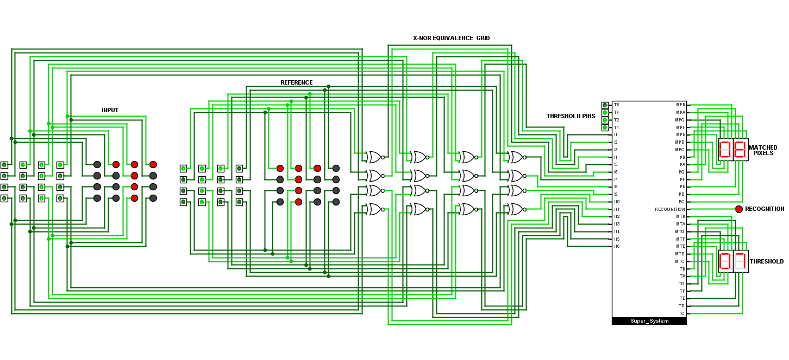
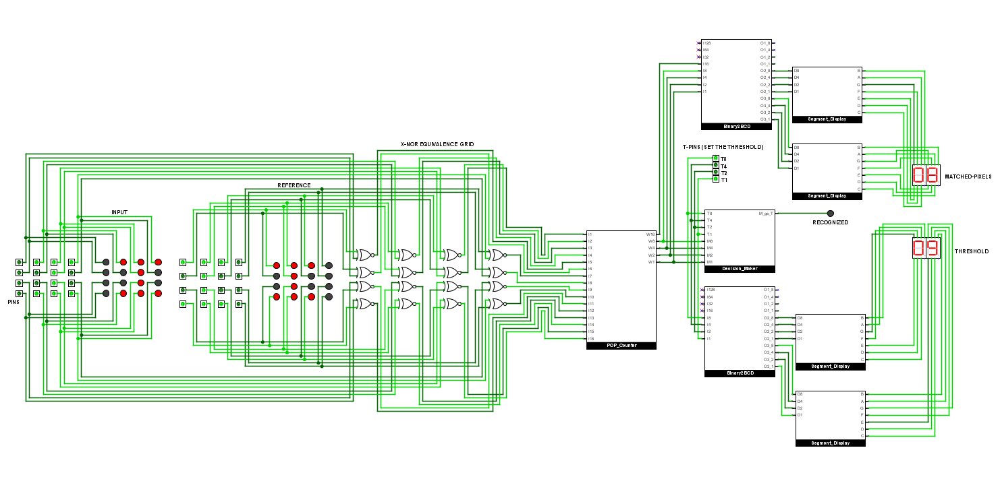
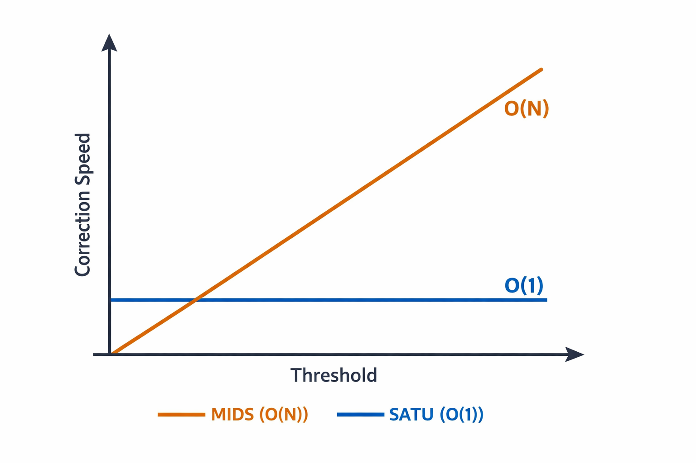
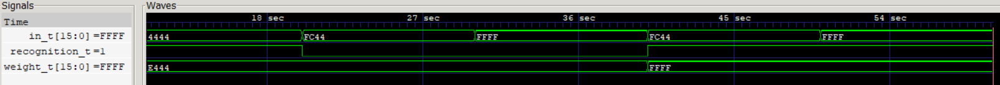
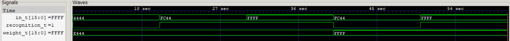
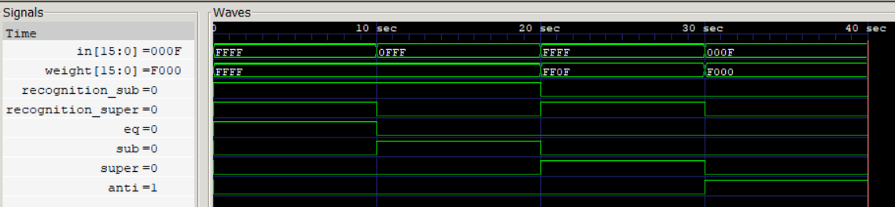
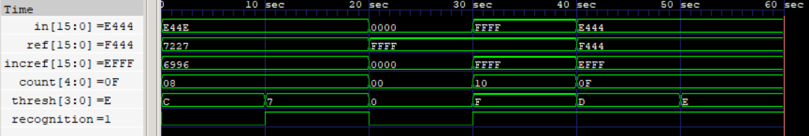

# 🔍 Gate Level Perceptron

- This project constructs a self-learning pattern recognition engine using discrete logic gates. Project evolves from strict boolean matching to score-based decision-making to feedback-driven adaptive learning and further to eventually a Hardware perceptron.

- `Progress:`Implemented a Cybernetic feedback-driven adaptive learning binary-classifier that based on error input autonomously alter its decision boundary by implementing [Max-Initialized Decremental Search](Detector_v1.1/Max-Initialized%20Decremental%20Search) (MIDS) and resets the control loop for repeated adaptive cycles.

<p align="center">
  
</p>

<p align="center">
  🤖 Cybernetic self-learning adaptive system implementing MIDS algorithm
</p>

## ⚙️ Implementation Stack


## 📈 Planned Progression
- **Stage 0 (v0.x)**: Strict Boolean pattern relation analyzer. No learning, no noise tolerance, decision boundaries fixed by structural wiring.
- **Stage 1 (v1.0)**: Popcount based similarity and a variable threshold to alter the decision boundary. Introduces noise tolerance and ability to change the decision output without structural changes.
- **Stage 2 (v1.1)**: Cybernetic Feedback-driven adaptive learning. System alters its own decision boundary based on external feedback to correct its decision output.
   - [MIDS Algorithm](Detector_v1.1/Max-Initialized%20Decremental%20Search)  **`⟵ DEVELOPED`**
   - [SATU Algorithm ](Detector_v1.1/State%20Aware%20Threshold%20Update) `⟵ NEXT`
- **Stage 3 (v2.x)**: A System that generalizes on training data and based on that makes decisions about unseen data.

## 🧱 Versions Built
- **`Version 0`**: A pattern relation analyzer that classifies how an input pattern relates to a stored pattern, enforces rule based recognition rather than learning.
  - [Detector_v0.0](Detector_v0.0) -> Recognizes the exact pattern and sub-patterns if they are inside the boundary set up by weights-grid.
  - [Detector v0.1](Detector_v0.1) -> Recognizes the exact pattern and super-patterns if they are outside the boundary set up by weights-grid.
  - [Detector v0.2](Detector_v0.2) -> Classifies the input as a sub-pattern, super-pattern, anti-pattern or equivalence precisely through a 2-POV logical analysis.

- **`Version 1`**: Pop-count based judgement against a variable Threshold instead of perfect equivalence check, takes us one step closer to self-learning adaptive machines.
  - [Detector_v1.0](Detector_v1.0) -> Recognizes the pattern if total number of matched pixels are greater than the set threshold which can vary giving us ability to control the decision output.

<p align="center">
  
</p>

<p align="center">
  θ = 7 & M = 8, M > θ: hence Pattern is recognized ✅
</p>

<p align="center">
  
</p>

<p align="center">
  θ = 9 & M = 8, M ≤ θ: hence Pattern is not recognized ❌
</p>

## 🧠 Adaptive Learning Algorithms 
- [Max-Initialized Decremental Search (MIDS)](Detector_v1.1/Max-Initialized%20Decremental%20Search)
- [State Aware Threshold Update (SATU)](Detector_v1.1/State%20Aware%20Threshold%20Update)

| Property | MIDS | SATU |
|---|---|---|
| Correction Speed | O(N) | O(1) |
| State Awareness | None | Current & desired output |
| Direction | Always starts from max, decrements | Sets to M or M-1 as needed |
| Initialization Bias | Instant correction for false positives | None |
| Hardware Complexity | Low - decrementer only | Higher - decrementer + decision logic |
| Area | Minimal | Larger |
| Guaranteed Convergence | Yes | Yes |

### 🎯 Convergence Proofs
- [MIDS Convergence Proof](https://github.com/KARAN-D05/Gate-Level-Perceptron/tree/main/Detector_v1.1/Max-Initialized%20Decremental%20Search#-convergence-proof)
- [SATU Convergence Proof](https://github.com/KARAN-D05/Gate-Level-Perceptron/tree/main/Detector_v1.1/State%20Aware%20Threshold%20Update#-convergence-proof)

<p align="center">
  
</p>

<p align="center">
  ⏱️ Correction Speed Complexity Comparison
</p>

## 💻 Verilog Implementation

### 🎯 Strict Boolean Matching
- [Detector_v0.0](Detector_v0.0/Verilog-Implementation)

<div align="center">
    
    <p> Equivalence & Sub-Pattern Recognition 🔹 </p>
</div>

- [Detector_v0.1](Detector_v0.1/Verilog-Implementation)

<div align="center">
    
    <p> Equivalence & Super-Pattern Recognition 🟦 </p>
</div>

- [Detector_v0.2](Detector_v0.2/Verilog-Implementation)

<div align="center">
    
    <p> Equivalence & Super & Sub & Anti-Pattern Recognition 🔹🟦 </p>
</div>

### 🔄 Popcount-Based Adaptive Learning

- [Detector_v1.0](Detector_v1.0/Verilog-Implementation)

<div align="center">
    
    <p> Manually Alterable Decision Boundary ⚖️ </p>
</div>

## 🛠️Current Development:
- Cybernetic Feedback-driven adaptive learning system implementing MIDS algorithm Developed✓

## ⬇️ Download This Repository

### 🪟 Windows
Download → [download_repos.bat](./download_repos.bat)
``` 
Double-click it and pick the repo(s) you want.
```

### 🐧 Linux / macOS
Download → [download_repos.sh](./download_repos.sh)
```
bash

chmod +x download_repos.sh
./download_repos.sh
```

> Always downloads the latest version.

## 🛠️ Toolchain & Repo Utilities - Built to make navigating and interacting with this repo easier

### 💻 Terminal-Based Manual
This project includes a built-in reference manual for the detector architecture that can be queried directly from your terminal. View full manual: [detector-manual](https://github.com/KARAN-D05/Gate-Level-Perceptron/tree/main/detector-manual)

**Linux / Mac:**
```bash
curl -O https://raw.githubusercontent.com/KARAN-D05/Gate-Level-Perceptron/main/detector-manual/run-detector-manual.sh
chmod +x run-detector-manual.sh
./run-detector-manual.sh
```

**Windows:**
```powershell
Invoke-WebRequest -Uri "https://raw.githubusercontent.com/KARAN-D05/Gate-Level-Perceptron/main/detector-manual/run-detector-manual.ps1" -OutFile "run-detector-manual.ps1"
powershell -ExecutionPolicy Bypass -File run-detector-manual.ps1
```

### 🔧 portmap - Verilog Port Extractor

`portmap` is a lightweight CLI tool that extracts port definitions (`input`, `output`, `inout`) from Verilog modules and presents them in a clean table or Markdown format.

#### 🔗 Source
https://github.com/KARAN-D05/portmap-HDL/blob/main/utils/portmap

#### 📦 Release (Download Binary)
https://github.com/KARAN-D05/portmap-HDL/releases/tag/v1.0.0

#### 🚀 Usage
```bash
portmap file.v
portmap file.v --md
```

### 🧰 Repo Filetree Generator
[Filetree](https://github.com/KARAN-D05/portmap-HDL/tree/main/utils) - A repository file tree generator that prints a visual directory tree with file-type icons and a file count breakdown by extension (`.v`, `.circ`, `.md`, `.py` and more).
  
**Utils (Portmap + Filetree)- Fetched automatically as a utils package alongside any repo download - includes portmap binaries, filetree, and source code via [download_repos.bat](download_repos.bat) / [download_repos.sh](download_repos.sh).**

## 📜License
- Source code and HDL files are licensed under the MIT License.
- Documentation, diagrams, images, and PDFs are licensed under Creative Commons Attribution 4.0 (CC BY 4.0).
